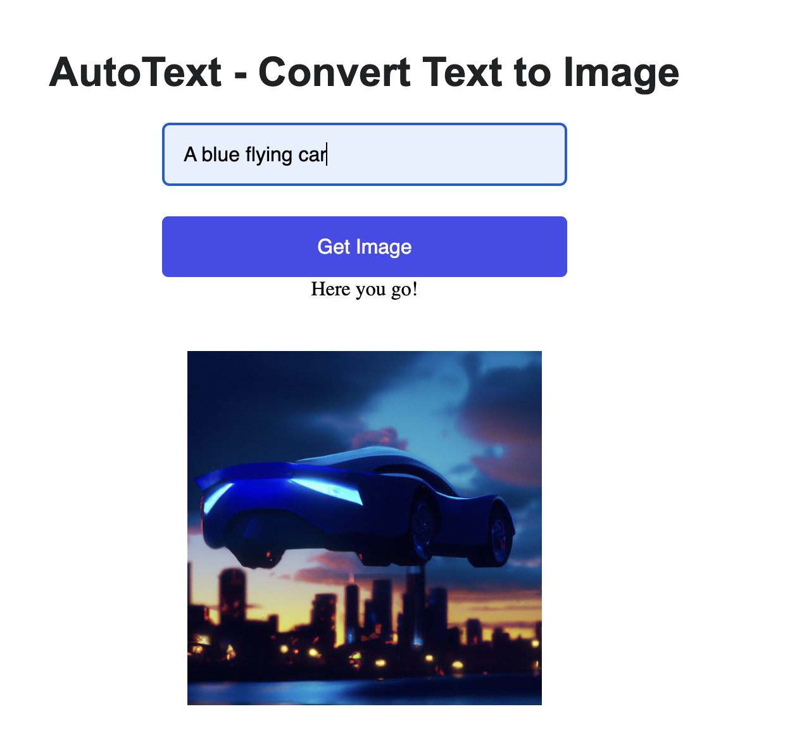
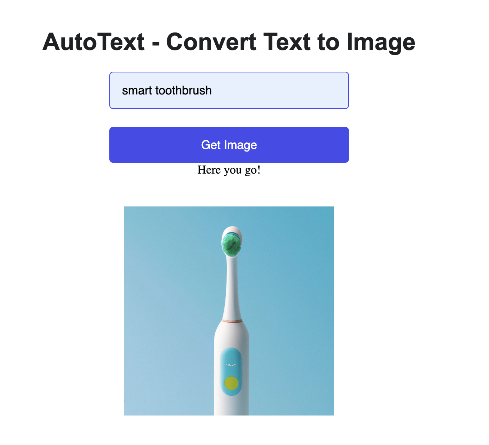
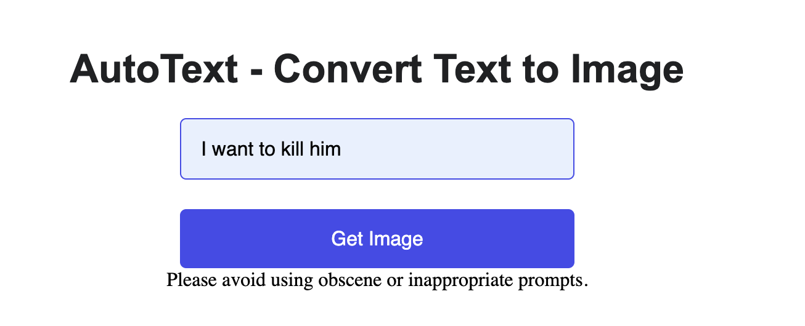

# AutoText Assignment

Objectives:

1. To create a RESTAPI endpoint that converts text to image. Use any Python framework to achieve this.

2. The output should cohere to these points:
- The generated image should look exactly as described in the text prompt.
- Any AI service available in the market can be used to achieve this.
- The image should not contain any obscene objects of interest.
- Marketing-specific content should be generated, taking into consideration the look & feel of the image (e.g., friendly, professional, personal).
- Each generated image is unique and cannot be reproduced.

## Project Description

1. Created a REST endpoint using Flask.
2. The application uses OpenAI API to generate images based on the user-given prompt
3. To restrict showing obscene objects of interest, I am using OpenAI Content Moderation API to moderate the content of the user-given prompt. If the user enters an inappropriate prompt, we return a warning.
4. To make the user-given prompt more marketing-specific and also make it consider the look & feel of the image, I am using the OpenAI text-DaVinci-003 model to refine the prompt.
   For example, if a user enters a prompt: "A glowing t-shirt"
   The application generates a new prompt: "A close-up photo of a happy woman wearing a designer glittering t-shirt, with a confident and modern smile, standing outdoors in a vibrant urban setting."
   This will help to generate better images which we expect.
5. In order to prevent duplicate images from being created, I have added a random seed to the prompt. The above step of refining the prompt also ensures uniqueness.
6. Please find attached screenshots in the repository.

## Setup to test this application

1. Clone this repository

2. Navigate into the project directory

   ```bash
   $ cd AutoText-TextToImage
   ```

3. Create a new virtual environment

   ```bash
   $ python -m venv venv
   $ . venv/bin/activate
   ```

4. Install the requirements

   ```bash
   $ pip install -r requirements.txt
   ```

5. Add your [API key](https://beta.openai.com/account/api-keys) to the `.env` file

6. Run the app

   ```bash
   $ flask run
   ```

## Output Screenshots

Below are examples of images generated by the AutoText application based on user prompts:






